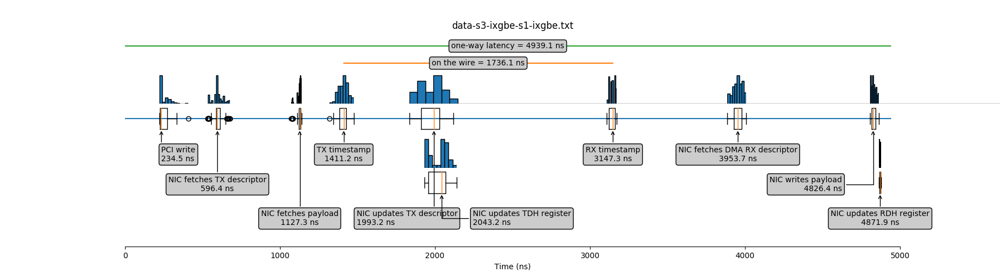
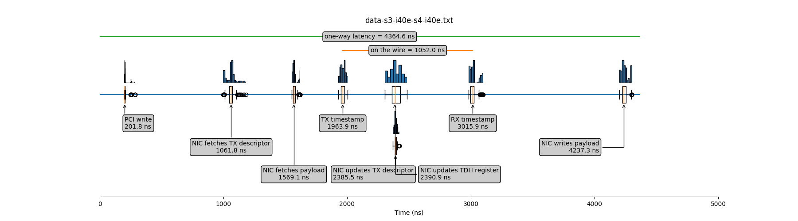

## NIC timeline

This tool measures the latency of the internal operations that take place during transmission and reception of packets through a NIC. It supports 2 types of NIC drivers: ixgbe and i40e.

The tool measures the following latencies on the transmitting side:

* PCI write
* The NIC fetches the TX descriptor
* The NIC fetches the payload
* The NIC applies the TX timestamp
* The NIC updates the TX descriptor (after the transmission)
* The NIC updates the head register of the TX ring buffer

On the receiving side, the tool measures the following latencies:

* The NIC applies the RX timestamp
* The NIC fetches the RX descriptor
* The NIC writes the payload in main memory
* The NIC updates the head register of the RX ring buffer

The figure below shows the timeline of transmitting and receiving a packet with an Intel 82599 NIC (ixgbe driver):

The figure below shows the timeline for an Intel XL710 NIC (i40e driver):

